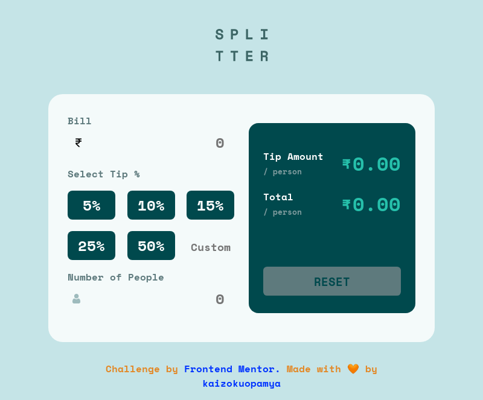

# Frontend Mentor - Tip calculator app

## Welcome! 👋
This is a solution to the [Tip calculator app challenge on Frontend Mentor](https://www.frontendmentor.io/challenges/tip-calculator-app-ugJNGbJUX). Frontend Mentor challenges help you improve your coding skills by building realistic projects.

## Table of contents

- [Overview](#overview)
  - [The challenge](#the-challenge)
  - [Screenshot](#screenshot)
  - [Links](#links)
- [My process](#my-process)
  - [Built with](#built-with)
  - [What I learned](#what-i-learned)
  - [Continued development](#continued-development)
  - [Useful resources](#useful-resources)
- [Author](#author)
- [Acknowledgments](#acknowledgments)

## Overview

I have completed this challenge provided by frontend mentor. It is responsive for all screen sizes and fully functional

### The challenge

Users should be able to:

- View the optimal layout for the app depending on their device's screen size
- See hover states for all interactive elements on the page
- Calculate the correct tip and total cost of the bill per person

### Screenshot

### Links

- Solution URL: [Github](https://github.com/kaizokuopamya/Splitter-Tip-Calculator)
- Live Site URL: [Splitter](https://splitterfem.netlify.app/)

## My process

I have approached designing with Mobile-first workflow added rupee symbol instead of dollar so that I can use it according to Indian currency standards

### Built with

- Semantic HTML5 markup
- CSS custom properties
- Flexbox
- CSS Grid
- Mobile-first workflow
- Responsive web design

### What I learned

This was an excellent challenge to improve my web designing approach and knowledge of Javascript, responsive web design

### Continued development

I'm thinking of adding Light/Dark toggle to change themes

### Useful resources

- [Kevin Powell (Conquering Responsive Layouts)](https://courses.kevinpowell.co/conquering-responsive-layouts) - To learn responsive design I have followed this course this helped me a lot.
- [Akshay Saini (Namaste Javascript)](https://www.youtube.com/playlist?list=PLlasXeu85E9cQ32gLCvAvr9vNaUccPVNP) - To understand basics and to fall in love with javascript I'll recommend this playlist

## Author

- Github - [@kaizokuopamya](https://github.com/kaizokuopamya)
- Frontend Mentor - [@kaizokuopamya](https://www.frontendmentor.io/profile/kaizokuopamya)

## Acknowledgments

[Frontend Mentor](https://www.frontendmentor.io) challenges help you improve your coding skills by building realistic projects.